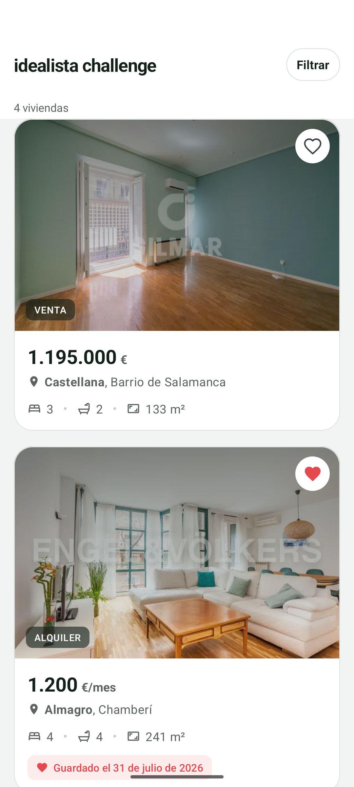
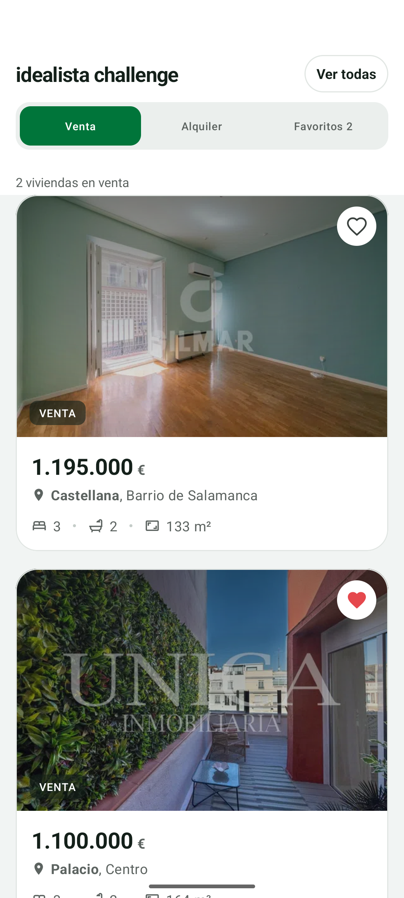
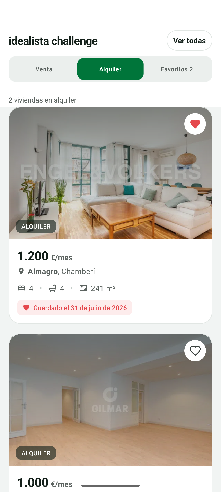
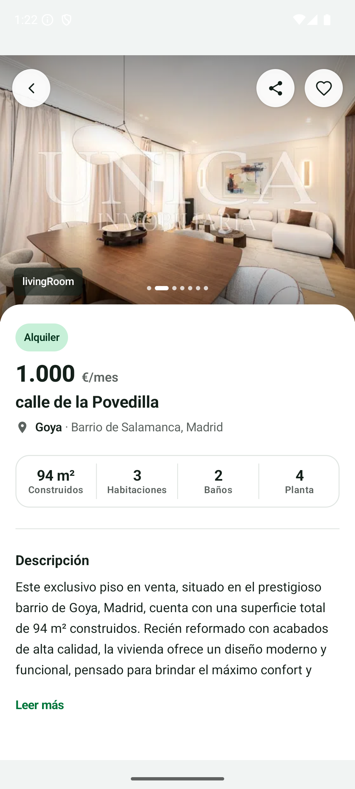
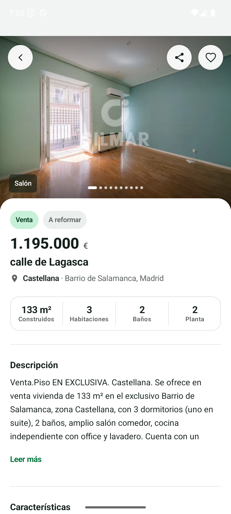
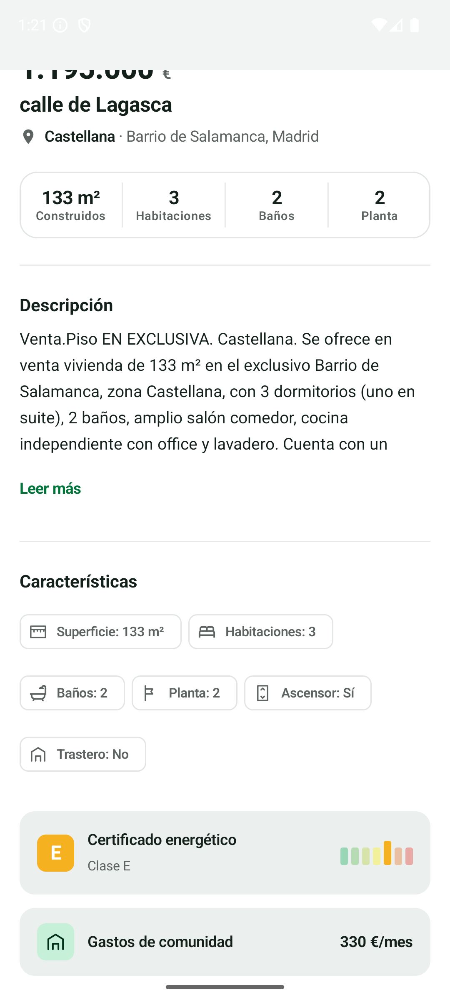
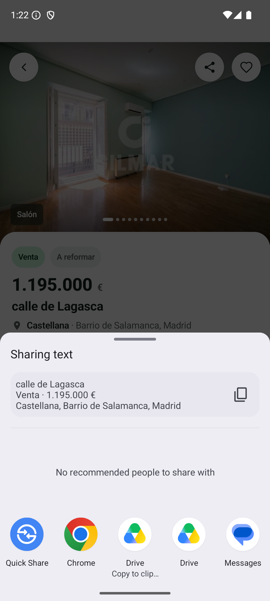

# Idealista Android Challenge 

Technical challenge for Idealista. The app fetches a property listing from a static JSON API, displays each property in an XML-based list, and opens a Jetpack Compose detail screen with a live favorites toggle backed by Room. It demonstrates clean multi-module architecture, strict dependency boundaries, both XML and Compose UI, Hilt DI, Jetpack Navigation, and an AI-assisted development workflow.

---

## Screenshots

<table>
  <tr>
    <th>Listing</th>
    <th>Detail</th>
    <th>Intent Share</th>
  </tr>
  <tr>
    <td>
      <br>
      <br>
      
    </td>
    <td>
      <br>
      <br>
      
    </td>
    <td>
      
    </td>
  </tr>
</table>

---

## Getting started

**Requirements:** JDK 17, Android Studio Meerkat or later, Android SDK 36.1.

```bash
# Clone and build
git clone <repo-url>
cd IdealistaChallenge
./gradlew clean assembleDebug

# Unit tests
./gradlew testDebugUnitTest

# Lint
./gradlew lintDebug

# Verify module boundaries (must print OK for both)
./gradlew :feature:list:dependencies | grep -E "core.network|core.database" && echo "VIOLATION" || echo "OK"
./gradlew :feature:detail:dependencies | grep -E "core.network|core.database" && echo "VIOLATION" || echo "OK"
```

### SDK versions

| Property | Value | Rationale |
|---|---|---|
| `compileSdk` | 36.1 (Android 16 QPR1) | Highest installed SDK. Uses AGP 9.x extended API: `release(36) { minorApiLevel = 1 }`. |
| `targetSdk` | 36 | Android 16 stable runtime behavior. |
| `minSdk` | 24 (Android 7.0) | Covers ~97% of active Android devices (Google Play distribution, 2025). |
| JVM toolchain | Java 17 | Required by AGP 9.x. LTS release, widely supported by CI. |

Toolchain: AGP 9.1.1 / Kotlin 2.2.10 / Gradle 9.3.1.

> **Lint suppressions:** `GradleDependency`, `AndroidGradlePluginVersion`, and `NewerVersionAvailable` are suppressed. `core-ktx ≥1.19.0` and `lifecycle ≥2.11.0` require compileSdk 37, which is not installed. Library versions are pinned to the latest compatible with android-36.1. Suppressions are documented inline in `app/build.gradle.kts`.

---

## Architecture

Eight production modules plus a shared `:core:testing` test-fixtures module, with strictly defined dependency boundaries.

```
         ┌──────────────────────────────────────────────────────┐
         │                       :app                          │
         │  Application class · MainActivity · NavGraph        │
         │  Hilt entry points (no repository implementations)  │
         └──┬──────────────────────────────────────────────────┘
            │
 ┌──────────▼──────────┐
 │     :core:data      │
 │  Repository impls   │
 │  InMemoryCache      │
 │  DispatcherProvider │
 └──┬──────────────┬───┘
    │              │
┌───▼──────┐  ┌────▼─────┐   ┌──────────────────────┐   ┌────────────────────┐
│:core:    │  │ :core:   │   │   :feature:list       │   │  :feature:detail   │
│network   │  │ database │   │  XML · ViewBinding    │   │  ComposeView       │
│Retrofit  │  │ Room     │   │  ListAdapter · Diff   │   │  StateFlow ViewModel│
│OkHttp    │  │ FavoriteDao│  │  LiveData ViewModel   │   └──────────┬─────────┘
│DTOs      │  │          │   └──────────┬────────────┘             │
└────┬─────┘  └────┬─────┘             │                           │
     │              │                  └──────────┬────────────────┘
     └──────┬───────┘                             │
    ┌────────▼──────────────────────┐    ┌────────▼──────────┐
    │        :core:domain           │    │   :core:design    │
    │  (pure Kotlin — java-library) │    │  Color · Type     │
    │  Domain models · UseCases     │    │  IdealistaTheme   │
    │  Repository interfaces        │    └───────────────────┘
    │  DataSource port interfaces   │
    └───────────────────────────────┘

    ┌────────────────────────┐
    │    :core:testing       │  ← testImplementation / androidTestImplementation only
    │  MainDispatcherRule    │
    │  Fake repositories     │
    │  Test fixtures         │
    └────────────────────────┘
```

**Dependency rules:**
- Feature modules depend only on `:core:domain` and `:core:design` — completely unaware of Retrofit or Room.
- `:core:domain` is pure Kotlin (`java-library` plugin). It imports nothing from `androidx.*`.
- `:core:design` is an Android library with no project-level imports — Compose needs the Android runtime but the module imports nothing from `:core:domain`.
- `:core:data` is the **only** module that depends on both `:core:network` and `:core:database`.
- `:app` depends on `:core:data` and both feature modules — not directly on `:core:network` or `:core:database`.
- `:core:testing` is declared in test scopes only; never in production `implementation`.

See `docs/adr/0001-modularization-strategy.md` and `.claude/skills/module-boundaries/SKILL.md`.

---

## Tech stack

- **Language:** Kotlin 2.0+ (K2 compiler) · Coroutines + Flow (no RxJava)
- **Build:** Gradle KTS + `libs.versions.toml` version catalog
- **DI:** Hilt — one `@Module` per core module
- **Network:** Retrofit + OkHttp + kotlinx.serialization · logging interceptor in `debug` only
- **Persistence:** Room · favorites table: `favorite(property_id TEXT PK, favorited_at INTEGER NOT NULL)`
- **Images:** Coil — `ImageView.load()` in XML, `AsyncImage` in Compose
- **Loading skeleton:** Shimmer (`ShimmerFrameLayout` wrapping XML placeholder views)
- **Navigation:** Jetpack Navigation Component · single Activity · two destinations
- **Listing UI:** XML + ViewBinding + `ListAdapter` + `DiffUtil` · ViewModel exposes LiveData
- **Detail UI:** `ComposeView` inside a Fragment · ViewModel exposes StateFlow · `collectAsStateWithLifecycle()`
- **Testing:** JUnit 4 · MockK · Turbine · kotlinx-coroutines-test · AssertK · Espresso · Compose UI Test
- **Static analysis:** Detekt + Ktlint (via Detekt) + Android Lint

All versions are in `gradle/libs.versions.toml`.

---

## Screens

### Listing (XML)

The listing screen (`feature:list`) uses a `RecyclerView` with `ListAdapter` and `DiffUtil` for efficient, animated updates. Each item shows the property thumbnail (Coil + Shimmer placeholder), price, operation type, location, and a favorite toggle button. The ViewModel (`ListingViewModel`) exposes state as `LiveData` — a deliberate choice documented in the ViewModel's KDoc because LiveData integrates cleanly with the Fragment lifecycle without requiring `collectAsStateWithLifecycle`. A filter chip row lets the user switch between All / Sale / Rent / Favorites views.

### Detail (Compose in Fragment)

The detail screen (`feature:detail`) renders inside a `ComposeView` embedded in `DetailFragment`. A `CoordinatorLayout` + `AppBarLayout` hosts a transparent `MaterialToolbar` over a `HorizontalPager` image gallery that auto-scrolls every 5 seconds (using `pagerState.settledPage` as the `LaunchedEffect` key). Below the gallery: price chip row, highlights grid, expandable description, characteristics `FlowRow`, energy certification card, community costs, and a static map placeholder. The favorite button persists the current timestamp on first tap; re-tapping updates the timestamp (upsert semantics, see ADR-0006).

---

## Handling API quirks

The challenge API has three documented quirks handled defensively:

1. **Dual price fields.** The listing response includes a top-level `price` field and a nested `priceInfo.price` field. Only `priceInfo.price` is reliable — `PropertyDtoMapper` ignores the top-level field entirely.
2. **Static detail endpoint.** `detail.json` always returns property `adid=1` regardless of which property was tapped. `ObservePropertyDetailUseCase` enriches the base property with detail data **only when `detail.adid == requestedPropertyId`**; otherwise the base property from the listing cache is returned. This avoids showing property 1's detail content for properties 2–n.
3. **Optional `parkingSpace` field.** The field is absent from some listing responses. `PropertyDtoMapper` defaults it to `false` rather than marking the parent nullable.

See `docs/adr/0002-static-detail-endpoint-handling.md` and `.claude/skills/api-contract/SKILL.md`.

---

## Testing strategy

Tests are written to catch real regressions, not to hit a coverage number. The test suite is organized by the boundary each test exercises: pure logic (mappers, use cases), state machine (ViewModels via Turbine), storage contract (Room DAOs with in-memory DB), and repository integration (fake API + fake DAO).

| Module | Test class | Tests | What's covered |
|---|---|---|---|
| `:core:data` | `PropertiesRepositoryImplTest` | 13 | Cache hits/misses, enrichment guard (ADR-0002), Mutex stampede protection, failed-refresh resilience |
| `:core:network` | `PropertyDtoMapperTest` | 6 | API contract quirks: `priceInfo` vs top-level `price`, absent `parkingSpace`, optional feature flags |
| `:feature:list` | `ListingViewModelTest` | 11 | Filter states (SALE/RENT/FAVORITES/ALL), retry flow, favorites count, empty vs content state |
| `:feature:list` | `PropertyMapperTest` | 8 | es-ES price formatting, thumbnail fallback chain, operation label, favorite date label |
| `:feature:detail` | `DetailViewModelTest` | 6 | Loading → Content → Error lifecycle, favorite toggle, retry |
| `:feature:detail` | `DetailMapperTest` | 11 | Price format, characteristics list presence/absence, energy letter→index, floor fallback, costs label |

---

## AI collaboration

This project was developed with Claude Code CLI (`claude-sonnet-4-6`) as a structured collaborator, not as a code generator. `CLAUDE.md` defines the rules, module structure, and agent remits. Six subagents handle specific concerns (`android-architect`, `domain-expert`, `ui-xml-engineer`, `ui-compose-engineer`, `testing-specialist`, `code-reviewer`); five frozen skills provide reference material loaded before each task. All product decisions and architecture choices were made by the human; agents execute within those constraints.

See `docs/ai-usage.md` for concrete examples, limitations, and a reproduction guide. See `.claude/agents/` for agent definitions and `.claude/skills/` for skill files.

---

## Architecture decisions

| # | Title | Status |
|---|---|---|
| [0001](docs/adr/0001-modularization-strategy.md) | Modularization strategy — 9 modules, `:core:data` as aggregation layer | Accepted |
| [0002](docs/adr/0002-static-detail-endpoint-handling.md) | Static detail endpoint — `adid=1` always, enrichment guard + in-memory cache | Accepted |
| [0003](docs/adr/0003-material-components.md) | Material Components, `:core:design` module, M3 design system | Accepted |
| [0005](docs/adr/0005-xml-compose-interoperability.md) | XML and Compose interoperability (`CoordinatorLayout` + `ComposeView`) | Accepted |
| [0006](docs/adr/0006-favorite-timestamp-semantics.md) | Favorite timestamp semantics — upsert on re-favorite | Accepted |
| [0009](docs/adr/0009-characteristics-flowrow-chips.md) | Characteristics section as `FlowRow` of `SuggestionChip` | Accepted |
ADR-0004 (No Paging 3), ADR-0007 (repository location), ADR-0008 (AI harness), and ADR-0010 (static map placeholder) were planned but not written; their decisions are in `CLAUDE.md §8`, ADR-0001, `docs/ai-usage.md`, and the "What I would do with more time" section respectively.

---

## What I would do with more time

- **Real map integration.** Integrate the Google Maps SDK or a key-free tile provider (MapLibre/OpenStreetMap). A live map requires an API key management strategy not suitable for a public challenge repo.
- **Offline-first with `NetworkBoundResource`.** The current flow fetches from network and caches in memory. A proper offline-first strategy would persist the listing to Room and serve stale data while refreshing in the background.
- **Paging when the endpoint is paginated.** The current endpoint returns all items in one response. If Idealista's production API is paginated, Paging 3 would replace the current `List<Property>` flow — but not before the endpoint actually requires it.
- **Espresso + Compose E2E test for the full favorite flow.** The `testing-specialist` agent defined the required flow (list → tap favorite → open detail → verify state → toggle off → back → verify list). It was not implemented due to time; the unit and ViewModel tests cover the individual pieces.
- **Dark mode theme.** `IdealistaTheme` in `:core:design` provides a single color scheme. A `darkColorScheme` variant following Material 3 tonality guidelines is straightforward to add and would complete the design system.

---

## Contact

Carlos Hinojosa — carlos.hinojosa.vaca@gmail.com
